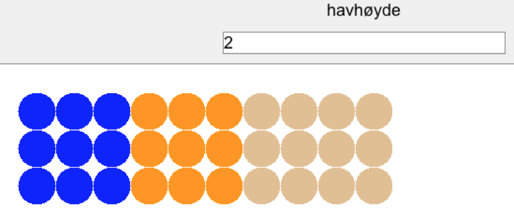
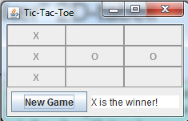

# DAT100: Java Programmering 6 - Uke 7 / 40

### Oppgave 1 - Matriser

Les beskrivelsen av matriser i oppgave 5.17 i java-boken.

##### a)

Lag en klasse om inneholder to matriser med tall som kan brukes til å test metodene nedenfor.

##### b)

Implementer en metode:

```java
public static void skrivUtv1()
```

som kan skrive ut en matrise. Bruk to nøstete for-løkker med tellevariabel. Test metoden.

##### c)

Implementer en metode  

```java
public static void skrivUtv2()
```

som i a) men som bruker to (nøstede) utvidede for-løkker (se avsnitt 5.6 i boken for beskrivelse av utvidet for-løkke). Test metoden.

##### d)

Implementer en metode

```java
public static boolean int[][] skaler(int tall, int[][] matrise)
```
som returnerer en ny matrise der alle tall i matrisen er multiplisert med parameteren tall. Test metoden.

##### e)

Implementer en metode

```java
public static int[][] speile(int [][] matrise)
```

som kan speile en kvadratisk matrise som beskrevet i oppgave 5.17. Test metoden.

##### f)	(Valgfri/vanskelig)

Implementer en metode

```java
public static int[][]
            multipliser(int[][] matrise1, int[][] matrise2)
```

som kan multiplisere to matriser. Test metoden. Vi har lov å multiplisere to matriser hvis antall kolonner i den første matrisen er lik antall rekker i den andre.

### Oppgave 2 - Arrays-klassen

I denne oppgaven skal du bruke metoder fra Arrays-klassen. Dokumentasjonen finnes her:
https://docs.oracle.com/javase/8/docs/api/java/util/Arrays.html

##### a)

Skriv en metode

```java
 public static int[] flette (int[] tabell1,int[] tabell2)
 ```

som tar to tabeller som parametere og returnerer en ny tabell som inneholder alle tallene fra de to tabeller sortert i stigende rekkefølge.

##### b)

Se på `equals`-metoden for Array-klassen og to tabeller `{1,4,5,6}` og `{5,4,1,6}`.

Skriv et program som bruker `equals` metoden til å sammenligne de to tabellene. Hva blir resultatet? Hva blir resultatet om vi sammenligner `{1,4,5,6}` og `{1,4,5,6}` ?

##### c)

Skriv en metode

```java
public static erLik(int[][] matrise1, int[][] matrise2)
```

som returnerer `true` hvis og kun hvis de to matriser `matrise1` og `matrise2` gitt som parameter er identiske dvs. har samme dimensjon og like innhold på de samme plassene. Test metoden – eksempelvis ved å bruke matriser fra oppgave 1.

### Oppgave 3 - Oversvømmelse

Høyde i et terreng kan representeres som en 2-dimensjonal tabell (eks. 3x10 felter)

```java
int[][] terreng = { { 0, 0, 0, 3, 3, 3, 6, 7, 8, 10 },
                    { 0, 0, 0, 3, 3, 3, 6, 7, 8, 10 },
                    { 0, 0, 0, 3, 3, 3, 6, 7, 8, 10 } };
```

Prosjektet F10FlerDimTabeller https://github.com/dat100hib/H2017/tree/master/forelesninger/F10/src/no/hvl/dat100 i oppbevaringsplassen med eksempler fra forelesninger inneholder en pakke `eksempler`.

I pakken finnes en klasse [Flooding.java](https://github.com/dat100hib/H2017/blob/master/forelesninger/F10/src/no/hvl/dat100/eksempler/Flooding.java) som inneholder starten på et program som kan visualisere konsekvens av en øking av hav-høyden. Hav-høyde leses inn via dialog-boks. Dette blev vist på forelesning.



Implementer ferdig metoden `visualiser()` slik at felter i området/tabellen `terreng` som kommer under havets overflate tegnes med en blå sirkel, felter som er mindre en 1 meter over havet tegnes med en oransje sirkel og de felter som er mer en 1 meter over havets overflate tegnes med en lysebrun sirkel. Sirkler tegnes ved å bruke easygraphics.

### Oppgave 4 - Bondesjakk

Prosjektet F10FlerDimTabeller https://github.com/dat100hib/H2017/tree/master/forelesninger/F10/src/no/hvl/dat100/tictactoe i oppbevaringsplassen med eksempler fra forelesninger inneholder en pakke `no.hvl.dat100.tictactoe` som implementerer det meste av koden for et bondesjakk spill. Dette ble demonstrert på forelesning.



For å avgjøre om en spiller har vunnet spillet trenger programmet følgende følgende tre metoder i klassen [GameController.java](https://github.com/dat100hib/H2017/blob/master/forelesninger/F10/src/no/hvl/dat100/tictactoe/GameController.java)

```java
private boolean checkHorizontal(int y, char player)

private boolean checkVertical(int x, char player)

private boolean checkDiagonals(char player)
```

Metodene skal avgjøre om karakteren gitt ved `player` (enten `´X´`eller `´O´``) finnes på en horisontal linje (gitt ved `x`), en vertikal linje (gitt ved y) eller på en av de to diagonaler.

Disse metoder vil (automatisk) bli kaldt av resten av programmet hver gang en spiller har gjort et trekk. Dvs. dere trenger kun å se på disse tre metodene og ikke resten av programmet.

Den aktuelle tilstand av brettet finnes i den to-dimensjonale tabellen board definert som

```java
char[][] board = new char[TicTacToe.SIZE][TicTacToe.SIZE];
```

der `TicTacToe.SIZE` angir størrelsen på brettet (i figuren ovenfor 3).

##### a)

Implementer de tre metoder ovenfor og test spillet. Det går fint an å implementer metodene en om gangen og teste de ved å starte spillet etter hvert. Main-metoden for programmet finnes i klassen [TicTacToe.java](https://github.com/dat100hib/H2017/blob/master/forelesninger/F10/src/no/hvl/dat100/tictactoe/TicTacToe.java).

##### b)

Prøv å endre på verdien av `SIZE` i klassen [TicTacToe.java](https://github.com/dat100hib/H2017/blob/master/forelesninger/F10/src/no/hvl/dat100/tictactoe/TicTacToe.java). Virker spillet fortsatt korrekt?

### Oppgave 5 - Arrays og kjøretid for Java-programmer

Oppgaven fokuserer på bruk Java API dokumentasjon   http://docs.oracle.com/javase/8/docs/api/ og måling av utføringstid for programmer.

Når der i API dokumentasjonen for Java plattformen står at en metode (eller klasse) er «deprecated» betyr at den er foreldet og at den dermed ikke skal brukes når vi lager ny kode. Grunnen til at foreldede metoder er fortsatt en del av mange Java pakker er for å sikre at koden som bruker en eldre versjon av API’en fortsatt kan kjøre uten at vi trenger å endre i koden.

De fleste programmene vi skriver i første semester vil utføres så raskt at det er vanskelig å måle utføringstiden av programmet.  På forelesningene har vi sagt at det finnes ferdige klasser i Java for å behandle tabeller. En slik klasse er Arrays (i pakken java.util). Her finnes det blant annet metoder for å sortere en tabell. Dersom vi sorterer en tabell med for eksempel 1000000 heltall, kan vi måle tiden ved hjelp av metoder i klassen System (i pakken java.lang) eller klassene Instant og Duration (i pakken java.time).

##### a)

Vi skal sette av plass til en tabell med 1000000 elementer. Deretter fyller vi den med slumptall (tilfeldige tall). Det finnes flere måter å generere tilfeldige tall i Java. Den enkleste er kanskje metoden `random()` i klassen `Math`. Denne metoden returnerer et flyttall større eller lik 0 og mindre enn 1.

Tabellen skal sorteres ved å bruke en passende metode fra klassen Arrays. Tiden for selve sorteringen skal måles og svaret skal skrives ut i millisekunder. Å lese API dokumentasjon for klassene `System` (eller `Instant` og `Duration`), `Math` og `Arrays` for å finne de rette metoder er en del av oppgaven.

##### b)

Varier antall av elementer i tabellen og undersøk hvordan utføringstiden påvirkes.
